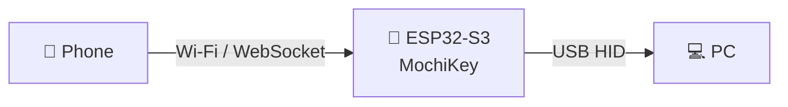

# 🍡 MochiKey — Wireless Phone Keyboard

A tiny and friendly **ESP32-S3 wireless keyboard project** that lets you use your phone as a keyboard for your PC.

Just open the MochiKey web page on your phone, type something, and the ESP32-S3 sends it to your computer as a normal USB keyboard. 📱 → ⌨️ → 💻

## ✨ Overview

MochiKey turns your phone into a simple wireless keyboard.

The ESP32-S3 connects directly to your PC through USB and appears as a standard **USB HID keyboard**.

Your phone connects to MochiKey wirelessly and uses a small web interface for typing, shortcuts, and media controls.

No application needs to be installed on the PC.

## 🌸 Features

- 📱 **Phone as Keyboard** — Type on your phone and send it directly to your PC
- ⌨️ **USB HID Keyboard** — PC recognizes MochiKey as a normal keyboard
- 🌐 **Cute Web Interface** — Control everything directly from your browser
- 📡 **Wireless Connection** — No keyboard cable between your phone and PC
- 📝 **Text Box** — Write text on your phone and send it to the computer
- ⚡ **Quick Keys** — Enter, Escape, Tab, Backspace, arrows, and more
- 🎵 **Media Controls** — Play/Pause, Volume Up/Down, Next and Previous
- 🎮 **Custom Buttons** — Create your own shortcut buttons
- 🔔 **Optional Feedback** — Small sound or visual feedback when a key is sent
- 🛡️ **Auto Key Release** — Automatically releases keys if the connection is interrupted
- 🌙 **Dark Mode** — Comfortable mobile interface for late-night use

## 🧸 Hardware Requirements

- 1× ESP32-S3 DevKitC-1
- 1× USB cable
- 📱 Phone / Tablet
- 💻 PC

## 🛠️ Tech Stack

- **Platform:** PlatformIO + Arduino Framework
- **USB Device:** TinyUSB HID
- **Wireless:** Wi-Fi
- **Web Interface:** HTML + CSS + JavaScript
- **Communication:** WebSocket
- **Device:** ESP32-S3

## 🍡 How It Works

1. The ESP32-S3 creates the MochiKey wireless interface.
2. Open the MochiKey web page from your phone.
3. Type text or press a shortcut button.
4. The phone sends the selected key to the ESP32-S3.
5. The ESP32-S3 sends it to the PC as a standard USB keyboard.

> 🍡 MochiKey does not need special keyboard software on the PC because it behaves like a normal USB HID keyboard.

## 📱 Mobile Interface

The web dashboard can include:

- ⌨️ Keyboard input
- 📝 Text sender
- ↩️ Enter / Tab / Escape
- ⬆️⬇️⬅️➡️ Arrow controls
- 🔊 Volume controls
- ⏯️ Media controls
- ⭐ Favorite shortcuts
- 🎨 Theme customization

## 🚀 Getting Started

1. Clone the repository and open it in PlatformIO.
2. Connect the ESP32-S3 to your computer.
3. Flash the MochiKey firmware.
4. Connect the ESP32-S3 to the PC using USB.
5. Connect your phone to the MochiKey wireless network.
6. Open the MochiKey web interface.
7. Start typing! 🍡⌨️

## 🔐 Privacy

MochiKey is designed as a simple keyboard controller.

It does **not** record the computer's keyboard input, collect passwords, or maintain a keystroke history.

Only commands intentionally entered through the MochiKey interface are sent to the connected computer.

## 🌱 Project Status

> 🎓 Educational term project — built for learning ESP32-S3, USB HID, wireless communication, and embedded web development.

More features and UI improvements are planned. ✨

## 📜 License

MIT
